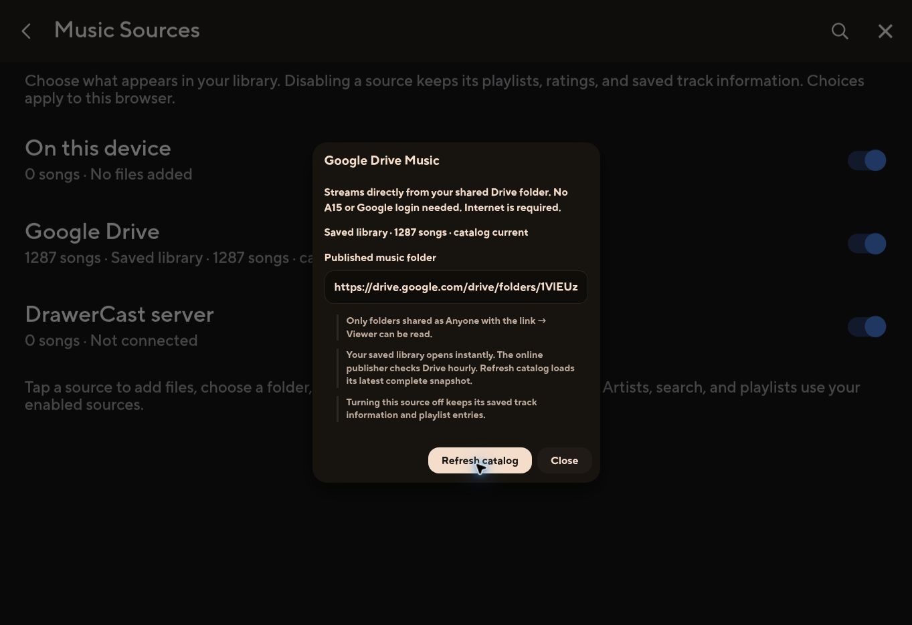

# Poweramp catalog v2 — live verification

Verified 2026-09-28 on https://missionarytube.z13.web.core.windows.net/drawercast/.

- Source revision: `b097a59a6c9b587ececea362c25fd25d1004bb9b`.
- Deployment revision: `5b92d39bb4a6c2c549495833d01e8943ee56f268`.
- Successful deployment: https://github.com/braydenparker000/Missionarytube-/actions/runs/36472892903.
- Catalog: 1,287 songs, 2 verified shards, generation `a13f0eaab5d621ed24a683a888c7d98caac0a8a763bad9372bd3769a7cc77ea1`.
- First publication prepared 250 metadata records. Remaining preparation continues in the hourly workflow (`17 * * * *`, best-effort GitHub scheduling).
- All 149 Jarvis tests and 519 deployment tests passed; static build and deployed asset/backend verification passed.
- Existing-browser migration installed the full catalog and retained the selected track's cached album tags. Manual Refresh returned “Saved library · 1287 songs · catalog current.”
- Drive playback reached 25 seconds with media readyState 4 and no media error. Category-forward and Next loaded different Drive tracks and reached readyState 4 without media errors. Keyboard seek advanced the selected track from about 22 to 32 seconds. Pause was exercised afterward.
- Automated failure coverage includes 10,000 records, corrupt/missing shards, count/root/schema/duplicate failures, unchanged generation, network/storage failure preservation, transaction completion/abort, moves/revisions, and absence of browser folder-list calls.
- Not verified on an actual Galaxy A15: screen-lock/background playback, device storage exhaustion, and prolonged offline recovery. No promise of playback without available audio bytes/network.

